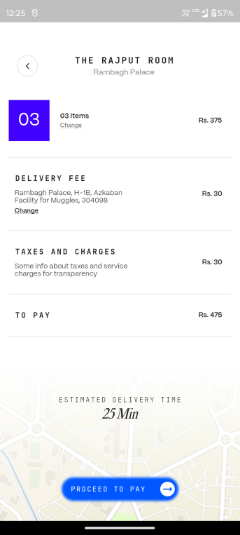
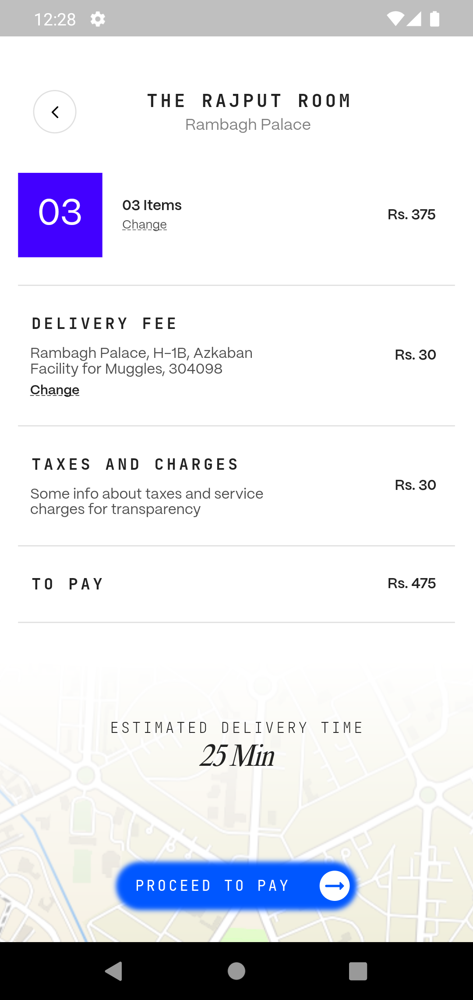

# Flutter Static Page Showcase

A Flutter project demonstrating a static page layout of one of the payment screens of ONDC Food App.

## Table of Contents

- [About](#about)
- [Screenshots](#screenshots)
- [To Run](#To Run)

## About

This Flutter project showcases a static page layout, serving as a simple example of how to create and style static pages using inbuilt Flutter widgets and minimal external packages.


## Screenshots



## To Run

To run this project locally, follow these steps:

1. Make sure you have Flutter installed. If not, [install Flutter](https://flutter.dev/docs/get-started/install).

2. Clone this repository:
   ```sh
   git clone https://github.com/Saurav-cruv/ONDC-Food-CartPaymentScreen.git
